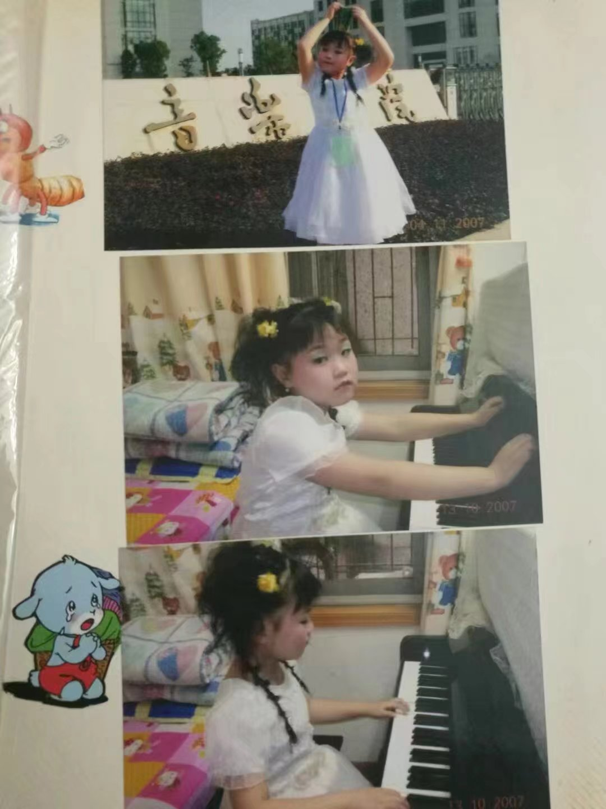
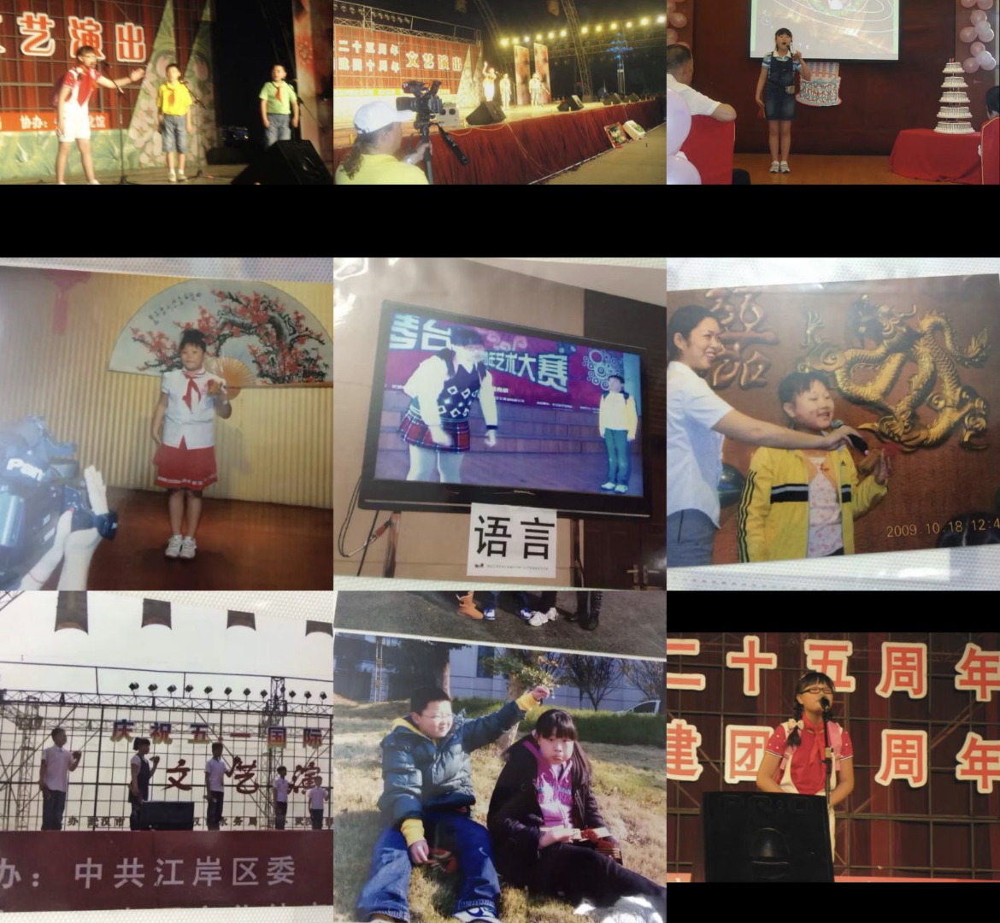
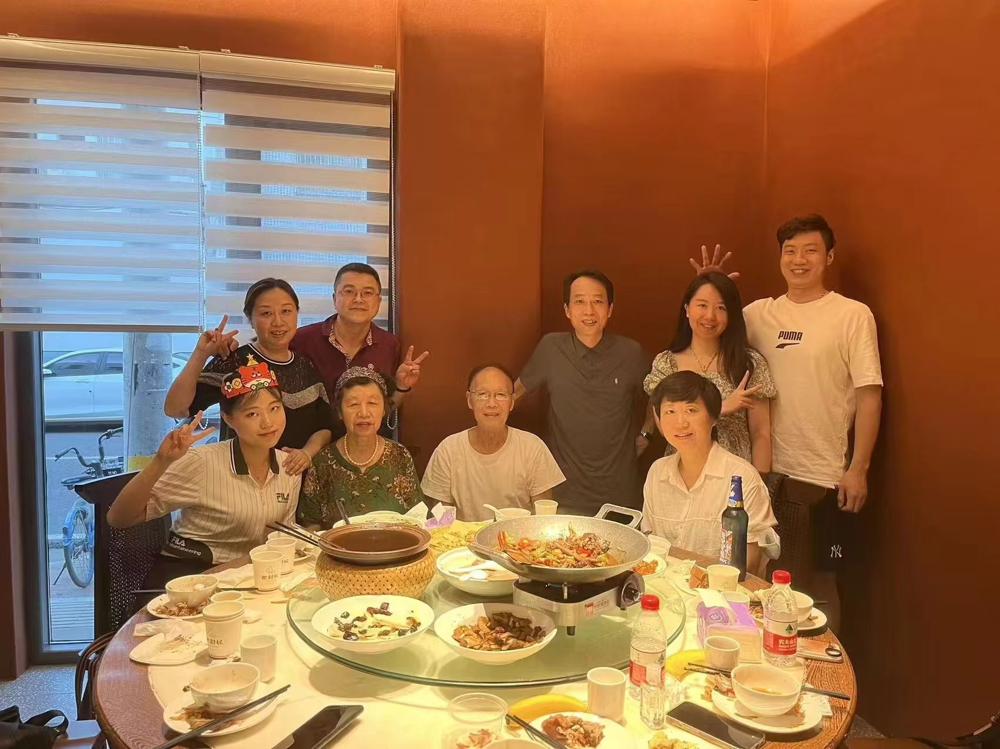

Hi, my name is Shi Zhixi (石芷溪) and you can also call me Yvonne. I am now working as a full-time Research Assistant in the department of Accountancy at City University of Hong Kong (CityU) and I will graduate with a Master's degree in Statistics from the National University of Singapore (NUS) in January 2024.I am eager to express my strong interest in pursuing a Ph.D. in Accounting, particularly focusing on Environmental, Social, and Governance (ESG) and Corporate Disclosures. My passion for these areas has been nurtured through a series of academic and professional experiences, which have shaped my academic aspirations and research goals.

You can find my CV here: [Zhixi's Curriculum Vitae](../assets/Curriculum_Vitae.pdf).

[Email](zhixi:e0950127@u.nus.edu)

Interests and Talents
======
I have learnt piano since 6 years old and passed level 10 (钢琴十级) during primary school. In addition, I have studied Chinese traditional performing arts (中国曲艺) for five years, including Kuaiban(快板) and Pingshu (评书), and have participated in the recording of some television programs.

My favourite singer and band is Jason Mraz and Mayday (五月天) and I also love singing and dancing.

Graduation
======
NUS

ZUEL

My family
======
I have a big and happy family and I love them very much!

