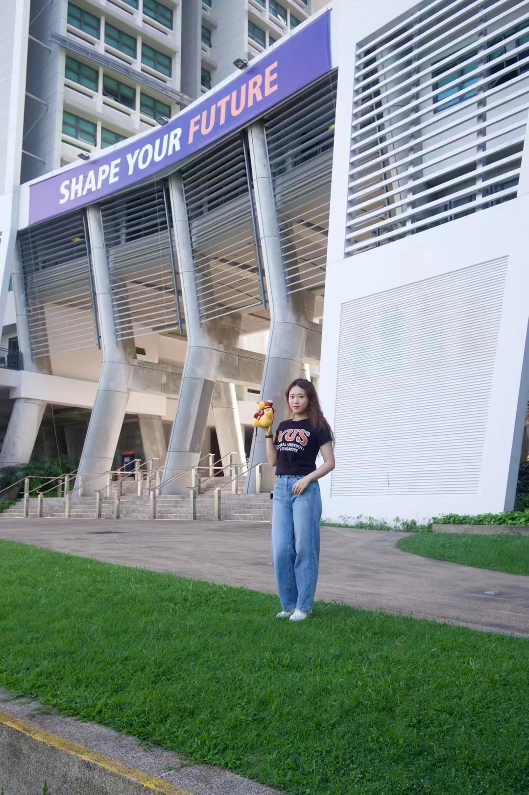
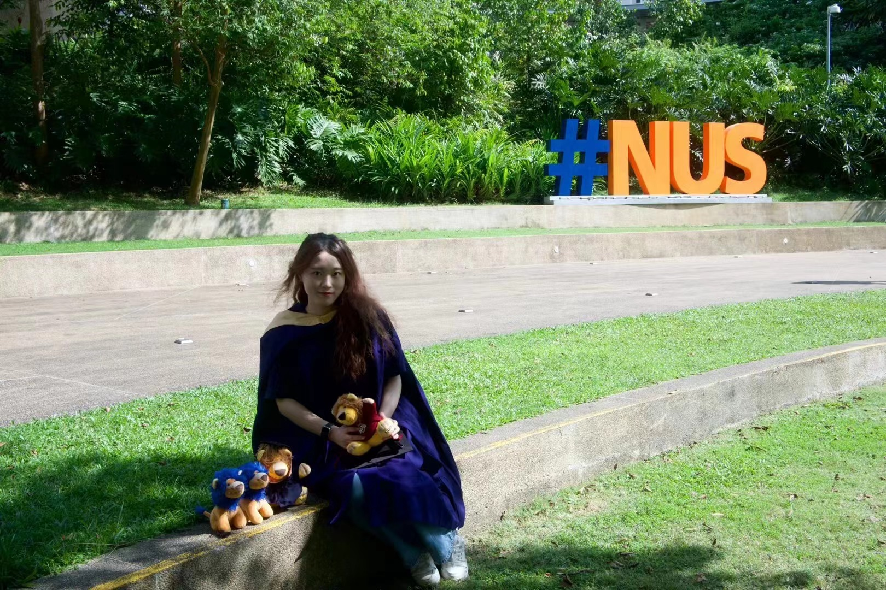
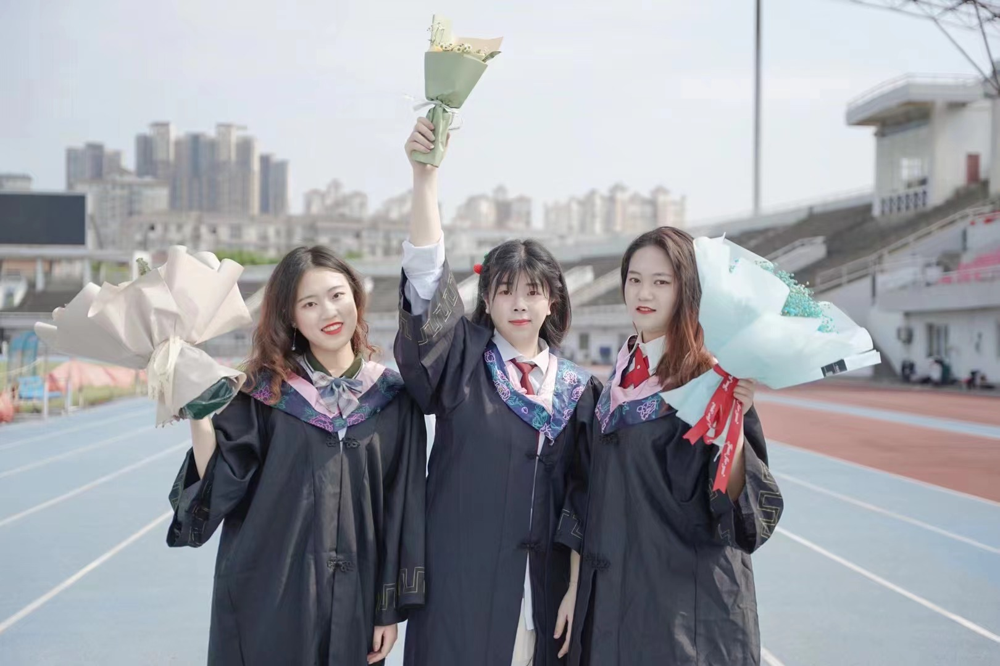

Hi, my name is Shi Zhixi (石芷溪) and you can also call me Yvonne. Currently, I serve as a full-time Research Assistant in the Accountancy department at City University of Hong Kong (CityU). I recently completed my Master's degree in Statistics at the National University of Singapore (NUS) earlier this year. This September, I will commence my PhD journey in Accounting at INSEAD (Asia Campus). My research interests primarily revolve around Environmental, Social, and Governance (ESG) issues and Corporate Disclosures.

You can find my CV here: [Zhixi's Curriculum Vitae](../assets/Curriculum_Vitae.pdf).

My Email:e0950127@u.nus.edu/yvonneshizhixi@163.com

Interests and Talents
======
I have learnt piano since 6 years old and passed level 10 (钢琴十级) during primary school. In addition, I have studied Chinese traditional performing arts (中国曲艺) for five years, including Kuaiban(快板) and Pingshu (评书), and have participated in the recording of some television programs.

My favourite singer and band is Jason Mraz and Mayday (五月天). I also love singing and dancing.

Graduation
======
NUS

ZUEL

